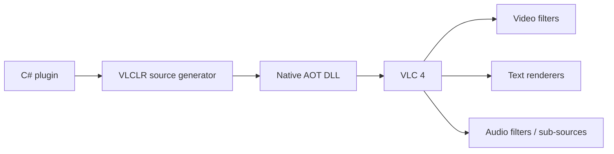

# VLCLR

> Experimental project. Do not use it in production.

**VLC + CLR = VLCLR** is a framework for authoring VLC 4.x plugins in C# and
publishing them as Native AOT libraries that VLC loads directly—without a
separate C shim.

Current target: Windows x64, .NET 10, VLC 4.0.6.



## What is included

- Attribute-based modules with generated exports, callbacks, configuration,
  exception boundaries, and instance lifecycle.
- Base classes and ABI wrappers for video, subtitle, audio, player, and
  playlist integration.
- Low-level fluent module registration for advanced or multi-module plugins.
- Unit, ABI, Native AOT export, VLC integration, visual, and benchmark coverage.

## Samples

Each sample owns its setup, commands, parameters, examples, architecture, and
troubleshooting documentation.

| Sample | Capability | Guide |
|---|---|---|
| YOLOX object detection | D3D11/OpenVINO GPU video filter with COCO-80 boxes and labels | [YoloObjectSearch](samples/YoloObjectSearch/README.md) |
| Privacy Shield | Composable GPU COCO-80, face, and plate detection with solid, mosaic, or blur redaction | [PrivacyShield](samples/PrivacyShield/README.md) |
| Diagnostic overlay | CPU video filter with ImageSharp text and graphics | [VideoOverlay](samples/VideoOverlay/README.md) |
| Styled subtitles | ImageSharp text renderer | [SubtitleRenderer](samples/SubtitleRenderer/README.md) |
| Offline subtitle translation | ONNX English-to-French text renderer | [SubtitleTranslator](samples/SubtitleTranslator/README.md) |
| Live speech translation | Audio filter, subtitle source, and external worker | [LiveAudioTranslator](samples/LiveAudioTranslator/README.md) |

## Requirements

- .NET SDK 10.0.102
- Windows x64 with an MSVC C++ toolchain
- `vswhere.exe` in `PATH`
- A VLC 4 development build compatible with plugin API 4.0.6
- `lib/libvlccore.lib` when publishing plugins
- Git Bash for visible VLC runs on Windows

Large model and runtime binaries are intentionally excluded from Git.

## Build and test

From the repository root:

```powershell
dotnet build vlclr.sln -c Release
dotnet test src/VLCLR.Tests -c Release
dotnet test tests/VLCLR.ObjectDetection.Tests -c Release
dotnet test tests/SubtitleTranslator.UnitTests -c Release
dotnet test tests/LiveAudioTranslator.ProtocolTests -c Release
```

Publish a Native AOT sample:

```powershell
$env:PATH += ';C:\Program Files (x86)\Microsoft Visual Studio\Installer'
dotnet publish samples/VideoOverlay -c Release -r win-x64
```

Model-free builds and unit tests do not download model assets.

## Minimal plugin

```csharp
using VLCLR.Plugin;

[VLCModule("my_filter")]
[VLCCapability("video filter", Score = 0)]
[VLCDescription("My C# video filter")]
public partial class MyFilter : VLCVideoFilterBase
{
    protected override void ProcessFrame(VLCFrame frame)
    {
        // Inspect or modify the negotiated VLC picture.
    }
}
```

The source generator supplies `vlc_entry`, module registration, native
callbacks, exception handling, and per-instance state. Advanced plugins can use
`VLCLR.Module.ModuleBuilder` directly.

## Repository map

| Path | Purpose |
|---|---|
| `src/VLCLR/` | Core bindings, wrappers, module registration, and plugin base classes |
| `src/VLCLR.Generators/` | Attribute-based VLC module source generator |
| `src/VLCLR.ImageSharp/` | Reusable frame and text-rendering helpers |
| `src/VLCLR.ObjectDetection/` | Detection contracts, COCO vocabulary, YOLOX decoding, query, timing, and persistence tracking |
| `src/VLCLR.LiveTranslation/` | Translation worker protocol and model profiles |
| `samples/` | Runnable Native AOT plugin examples with per-sample guides |
| `tests/` | Unit, ABI, integration, and visual harnesses |
| `benchmarks/` | Rendering, inference, and playback measurements |

## Documentation approach

- This README is the concise project entry point.
- Each sample README is the operational guide for that plugin.
- Planning documents remain local and are intentionally excluded from Git.
- Benchmark result files retain machine-specific measurements.

## License

See individual source files and model manifests for licensing information.
