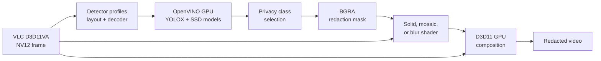

# Privacy Shield

Native AOT VLC 4 video filter that detects selected COCO-80 object classes,
faces, and license plates, then redacts them on the GPU with solid, mosaic, or
blur effects. It defaults to a full-opacity black region over each detected
person.

> This is a technical sample, not a certified anonymization system. Detection
> can miss partially visible, small, blurred, or unusual objects. Validate the
> output before sharing sensitive video.



The decoder surface is read-only. Redaction is composed into a pooled output
picture, avoiding corruption of hardware-decoder reference frames.

## Quick start

First follow the
[OpenVINO runtime setup](../YoloObjectSearch/README.md#model-and-runtime). A
YOLOX model is needed for COCO classes. Download the pinned, checksum-verified
face and plate models with:

```powershell
samples\PrivacyShield\download-sensitive-models.ps1
```

Then build and deploy from PowerShell:

```powershell
$env:PATH += ';C:\Program Files (x86)\Microsoft Visual Studio\Installer'

dotnet publish samples\PrivacyShield -c Release -r win-x64

Copy-Item `
  samples\PrivacyShield\bin\Release\net10.0\win-x64\native\libdotnet_privacy_shield_plugin.dll `
  vlc-binaries\vlc-4.0.0-dev\plugins\video_filter\ `
  -Force

vlc-binaries\vlc-4.0.0-dev\vlc-cache-gen.exe `
  vlc-binaries\vlc-4.0.0-dev\plugins
```

Start VLC from Git Bash and choose a video manually:

```bash
cd /c/path/to/vlclr

ROOT="$(pwd -W)"
MODEL="$ROOT/artifacts/models/yolox/yolox_nano.onnx"
FACE_MODEL="$ROOT/samples/PrivacyShield/models/open-model-zoo/face-detection-retail-0004.xml"
PLATE_MODEL="$ROOT/samples/PrivacyShield/models/open-model-zoo/vehicle-license-plate-detection-barrier-0106.xml"
RUNTIME="$ROOT/artifacts/openvino-runtime-2026.2.1/runtimes/win-x64/native"

./vlc-binaries/vlc-4.0.0-dev/vlc.exe \
  --no-one-instance \
  --video-filter=dotnet_privacy_shield \
  --dotnet-privacy-shield-model="$MODEL" \
  --dotnet-privacy-shield-face-model="$FACE_MODEL" \
  --dotnet-privacy-shield-license-plate-model="$PLATE_MODEL" \
  --dotnet-privacy-shield-runtime-dir="$RUNTIME" \
  --dotnet-privacy-shield-classes="person,face,license-plate"
```

Use **Media → Open File**, press **Ctrl+O**, or drag a video into the window.
Keep D3D11 hardware decoding enabled; this sample has no CPU-frame fallback.

## Parameters

| VLC option | Type / range | Default | Meaning |
|---|---:|---:|---|
| `--dotnet-privacy-shield-model=<path>` | File path | `yolox_nano.onnx` | YOLOX-Nano or YOLOX-Tiny 416 ONNX graph |
| `--dotnet-privacy-shield-face-model=<path>` | XML file path | empty | Open Model Zoo `face-detection-retail-0004` IR; its `.bin` must be beside it |
| `--dotnet-privacy-shield-license-plate-model=<path>` | XML file path | empty | Open Model Zoo `vehicle-license-plate-detection-barrier-0106` IR; its `.bin` must be beside it |
| `--dotnet-privacy-shield-runtime-dir=<path>` | Directory | empty | Directory containing `openvino_c.dll` and `openvino.dll`; alternatively set `OPENVINO_RUNTIME_DIR` |
| `--dotnet-privacy-shield-classes="<list>"` | Privacy labels, `all`, or `*` | `person` | Comma-separated COCO labels, `face`, or `license-plate` classes to cover |
| `--dotnet-privacy-shield-confidence=<value>` | `0.01`–`1.0` | `0.30` | Minimum objectness × class confidence |
| `--dotnet-privacy-shield-rate=<hz>` | `1`–`60` | `15` | Maximum GPU inference submissions per second |
| `--dotnet-privacy-shield-mode=<effect>` | `solid`, `mosaic`, or `blur` | `solid` | Redaction effect applied inside each selected region |
| `--dotnet-privacy-shield-blur-radius=<pixels>` | `4`–`128` | `32` | Approximate source-pixel radius used by `blur` |
| `--dotnet-privacy-shield-pixel-size=<pixels>` | `4`–`128` | `24` | Approximate source-pixel block size used by `mosaic` |
| `--dotnet-privacy-shield-padding=<pixels>` | `0`–`200` | `12` | Extra source-video pixels around every detection |
| `--dotnet-privacy-shield-ttl-ms=<ms>` | `50`–`2000` | `250` | Maximum media-time age of a redaction |
| `--dotnet-privacy-shield-hold-ms=<ms>` | `0`–`5000` | `500` | Keep an unmatched tracked region after a sampled inference miss |

At most 32 regions per detector and 96 total regions are rendered per frame.
Lower confidence finds more objects but increases false positives. More padding
reduces edge exposure around a moving subject. A longer hold reduces flicker
and brief exposure at the cost of leaving a box behind momentarily after an
object exits.

`solid` gives the strongest visual concealment. `mosaic` and `blur` preserve
scene context but should not be assumed to make a person or object
unrecognizable; choose effect sizes for the output resolution and risk model.

## Examples

Redact people:

```bash
./vlc-binaries/vlc-4.0.0-dev/vlc.exe \
  --video-filter=dotnet_privacy_shield \
  --dotnet-privacy-shield-model=C:/models/yolox_nano.onnx \
  --dotnet-privacy-shield-runtime-dir=C:/openvino/runtime \
  --dotnet-privacy-shield-classes=person \
  file:///C:/Videos/interview.mp4
```

Redact faces without loading YOLOX:

```bash
./vlc-binaries/vlc-4.0.0-dev/vlc.exe \
  --video-filter=dotnet_privacy_shield \
  --dotnet-privacy-shield-face-model=C:/models/face-detection-retail-0004.xml \
  --dotnet-privacy-shield-runtime-dir=C:/openvino/runtime \
  --dotnet-privacy-shield-classes=face \
  file:///C:/Videos/interview.mp4
```

Redact license plates without loading YOLOX:

```bash
./vlc-binaries/vlc-4.0.0-dev/vlc.exe \
  --video-filter=dotnet_privacy_shield \
  --dotnet-privacy-shield-license-plate-model=C:/models/vehicle-license-plate-detection-barrier-0106.xml \
  --dotnet-privacy-shield-runtime-dir=C:/openvino/runtime \
  --dotnet-privacy-shield-classes=license-plate \
  file:///C:/Videos/traffic.mp4
```

Compose all three detector profiles:

```bash
./vlc-binaries/vlc-4.0.0-dev/vlc.exe \
  --video-filter=dotnet_privacy_shield \
  --dotnet-privacy-shield-model=C:/models/yolox_nano.onnx \
  --dotnet-privacy-shield-face-model=C:/models/face-detection-retail-0004.xml \
  --dotnet-privacy-shield-license-plate-model=C:/models/vehicle-license-plate-detection-barrier-0106.xml \
  --dotnet-privacy-shield-runtime-dir=C:/openvino/runtime \
  --dotnet-privacy-shield-classes="person,face,license-plate" \
  file:///C:/Videos/street-interview.mp4
```

Use a 32-pixel mosaic:

```bash
./vlc-binaries/vlc-4.0.0-dev/vlc.exe \
  --video-filter=dotnet_privacy_shield \
  --dotnet-privacy-shield-model=C:/models/yolox_nano.onnx \
  --dotnet-privacy-shield-runtime-dir=C:/openvino/runtime \
  --dotnet-privacy-shield-mode=mosaic \
  --dotnet-privacy-shield-pixel-size=32 \
  file:///C:/Videos/interview.mp4
```

Use a 48-pixel blur:

```bash
./vlc-binaries/vlc-4.0.0-dev/vlc.exe \
  --video-filter=dotnet_privacy_shield \
  --dotnet-privacy-shield-model=C:/models/yolox_nano.onnx \
  --dotnet-privacy-shield-runtime-dir=C:/openvino/runtime \
  --dotnet-privacy-shield-mode=blur \
  --dotnet-privacy-shield-blur-radius=48 \
  file:///C:/Videos/interview.mp4
```

Redact road users and vehicles:

```bash
./vlc-binaries/vlc-4.0.0-dev/vlc.exe \
  --video-filter=dotnet_privacy_shield \
  --dotnet-privacy-shield-model=C:/models/yolox_nano.onnx \
  --dotnet-privacy-shield-runtime-dir=C:/openvino/runtime \
  --dotnet-privacy-shield-classes="person,bicycle,car,motorcycle,bus,truck" \
  --dotnet-privacy-shield-confidence=0.25 \
  --dotnet-privacy-shield-padding=20 \
  file:///C:/Videos/street.mp4
```

Redact every recognized class:

```bash
./vlc-binaries/vlc-4.0.0-dev/vlc.exe \
  --video-filter=dotnet_privacy_shield \
  --dotnet-privacy-shield-model=C:/models/yolox_nano.onnx \
  --dotnet-privacy-shield-runtime-dir=C:/openvino/runtime \
  --dotnet-privacy-shield-classes=all \
  file:///C:/Videos/test.mp4
```

## What it can redact

YOLOX recognizes the same
[80 COCO classes](../YoloObjectSearch/README.md#detectable-classes) as the
object-search sample. The optional Open Model Zoo profiles add `face` and
`license plate`; aliases such as `faces`, `plate`, and `license-plate` are
case-insensitive. Commas compose classes across detectors.

The
[face model](https://docs.openvino.ai/2023.3/omz_models_model_face_detection_retail_0004.html)
is a front-facing indoor/outdoor SSD model with 83% AP in its published
evaluation, which counted only faces larger than 60 × 60 pixels. The
[plate model](https://docs.openvino.ai/2023.3/omz_models_model_vehicle_license_plate_detection_barrier_0106.html)
is specialized for front-facing cars in a Chinese barrier-camera dataset and
publishes a minimum plate width of 96 pixels. Those domain limits matter:
neither model should be assumed to generalize to every camera angle, country,
plate style, occlusion, or resolution.

Selecting `person` covers the detected person's full bounding box; selecting
`face` covers only the detected face. Selecting `all` always loads the COCO
profile and additionally loads face or plate profiles when their model paths
are supplied.

## Playback behavior

- Inference and redaction selection advance only when media timestamps advance.
- Each detector owns its inference cadence and persistence tracker. Matching
  boxes are associated by class and overlap, then merged into one GPU mask. A
  missed inference keeps each previous region for the configured hold time
  instead of flashing it off.
- Pausing freezes the current mask; visible redactions remain on the paused
  frame.
- Seeking or flushing invalidates old results.
- Results older than the configured media-time TTL disappear during playback.
- Initialization or inference failures are logged and playback continues
  without redaction.

## Troubleshooting

Add `--vvv` and inspect `[PrivacyShield]` messages. Startup diagnostics identify
the active chroma, model path, OpenVINO version, adapter, driver, D3D feature
level, texture format, and the failing pipeline stage.

| Symptom | Check |
|---|---|
| Plugin is missing | Keep the `_plugin.dll` suffix, deploy to `plugins/video_filter`, and regenerate the VLC cache |
| Startup check failed (chroma) | Enable D3D11 hardware decoding and Direct3D11 video output |
| OpenVINO runtime check fails | Use the complete validated OpenVINO 2026.2.1 native runtime |
| GPU pipeline startup fails | Update the Intel graphics driver and keep decode and inference on the same adapter |
| Playback starts before redaction | The first GPU model compilation can take tens of seconds, especially for the plate model; inspect the activity log before evaluating output |
| An object is missed | Lower confidence, increase padding/TTL, or use a model trained for that object and risk profile |
| The wrong objects are covered | Raise confidence or narrow `--dotnet-privacy-shield-classes` |
| Visible VLC launch hangs | Launch VLC from Git Bash and use `file:///C:/...` media URLs |

## Validation

```powershell
dotnet build samples\PrivacyShield -c Release
dotnet test tests\VLCLR.ObjectDetection.Tests -c Release
dotnet publish samples\PrivacyShield -c Release -r win-x64
samples\PrivacyShield\download-sensitive-models.ps1
```

The precompiled Direct3D 11 shaders are embedded in the plugin. After editing
`Shaders/PrivacyOverlay.hlsl`, regenerate them with a Windows SDK installation:

```powershell
samples\PrivacyShield\Shaders\compile.ps1
```

The filter shares the validated D3D11 scaler, generic OpenVINO detection
session, output-picture allocator, and compositor implementation with
`YoloObjectSearch`. Detector profiles provide input size, resize policy,
NCHW/NHWC layout, and output decoder; Privacy Shield owns class selection,
per-detector persistence, result merging, and redaction policy.

Capture post-filter proof frames with:

```bash
./vlc-binaries/vlc-4.0.0-dev/vlc.exe \
  --video-filter=dotnet_privacy_shield:scene \
  --dotnet-privacy-shield-model=C:/models/yolox_nano.onnx \
  --dotnet-privacy-shield-runtime-dir=C:/openvino/runtime \
  --dotnet-privacy-shield-classes=person \
  --scene-format=png \
  --scene-path=C:/captures/privacy-shield \
  --scene-ratio=30 \
  file:///C:/Videos/test.mp4
```

## Current limitations

- Windows x64, D3D11 NV12, and Intel OpenVINO GPU only.
- Effects use rectangular masks. YOLOX uses a 416 × 416 letterboxed input;
  face and plate SSD profiles use stretched 300 × 300 inputs.
- The provided plate model is domain-specific, and the Open Model Zoo project
  is in maintenance mode. Replace profiles and models for the target geography,
  camera placement, and risk level.
- The tracker associates overlapping boxes and holds their last positions; it
  does not estimate motion between inference samples. This is a demo
  architecture and must not be treated as a guarantee that sensitive content
  is hidden.
