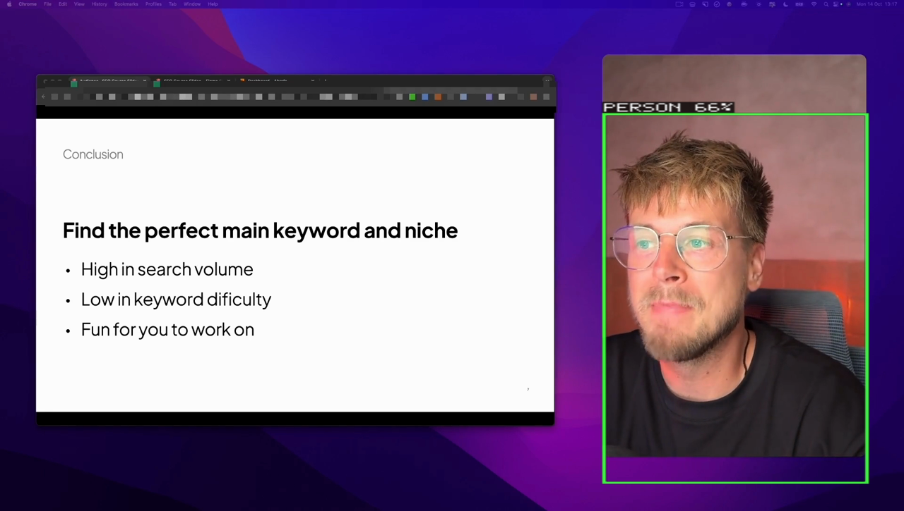
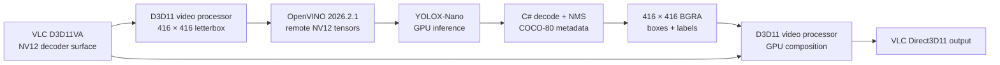

# YOLOX Object Detection

Pure-C# Native AOT VLC 4 video filter for real-time, local COCO-80 object
detection on D3D11/OpenVINO GPU.

It draws full-color boxes with class/confidence labels, accepts optional
object-search queries, drops stale results after seeks, and freezes inference
and composition while playback is paused.



_Real post-filter frame captured by VLC's `scene` filter. The query was
`person confidence 0.15`; the model reported 66%._



Video pixels remain on the GPU. C# handles only detection metadata and the
small transparent overlay layer. Composition targets pooled output pictures;
hardware-decoder surfaces remain read-only so box pixels cannot contaminate
future motion-compensated frames.

## Quick start

After installing the model and runtime as described below, start VLC from Git
Bash with detection enabled and choose a video manually:

```bash
cd /c/path/to/vlclr

ROOT="$(pwd -W)"
MODEL="$ROOT/artifacts/models/yolox/yolox_nano.onnx"
RUNTIME="$ROOT/artifacts/openvino-runtime-2026.2.1/runtimes/win-x64/native"

./vlc-binaries/vlc-4.0.0-dev/vlc.exe \
  --no-one-instance \
  --video-filter=dotnet_yolo_search \
  --dotnet-yolo-search-model="$MODEL" \
  --dotnet-yolo-search-runtime-dir="$RUNTIME" \
  --dotnet-yolo-search-confidence=0.30 \
  --dotnet-yolo-search-rate=15
```

Use **Media → Open File**, press **Ctrl+O**, or drag a video into that VLC
window. Do not pass `--no-hw-dec`; this plugin requires D3D11 hardware frames.

## Build and deploy

Run from PowerShell:

```powershell
$env:PATH += ';C:\Program Files (x86)\Microsoft Visual Studio\Installer'

dotnet publish samples\YoloObjectSearch -c Release -r win-x64

Copy-Item `
  samples\YoloObjectSearch\bin\Release\net10.0\win-x64\native\libdotnet_yolo_search_plugin.dll `
  vlc-binaries\vlc-4.0.0-dev\plugins\video_filter\ `
  -Force

vlc-binaries\vlc-4.0.0-dev\vlc-cache-gen.exe `
  vlc-binaries\vlc-4.0.0-dev\plugins
```

Output:

```text
samples/YoloObjectSearch/bin/Release/net10.0/win-x64/native/libdotnet_yolo_search_plugin.dll
```

VLC plugin filenames must end in `_plugin.dll`.

## Model and runtime

The validated combination is:

| Component | Version |
|---|---|
| Model | Official YOLOX-Nano, 416 × 416, COCO-80 |
| Model SHA-256 | `c789161ed43c8269fcd4e67c67eeeb4e80c622da2eb296a20bc6007bd18a0b7d` |
| OpenVINO | 2026.2.1 |
| Device | Intel GPU through D3D11 remote tensors |

Download the model:

```powershell
$modelDirectory = 'artifacts\models\yolox'
New-Item -ItemType Directory -Force -Path $modelDirectory | Out-Null

curl.exe -L --fail `
  --output "$modelDirectory\yolox_nano.onnx" `
  https://github.com/Megvii-BaseDetection/YOLOX/releases/download/0.1.1rc0/yolox_nano.onnx

Get-FileHash -Algorithm SHA256 "$modelDirectory\yolox_nano.onnx"
```

Download the validated native runtime layout:

```powershell
$package = 'artifacts\openvino.runtime.win.2026.2.1.nupkg'
$runtimeRoot = 'artifacts\openvino-runtime-2026.2.1'

curl.exe -L --fail `
  --output $package `
  https://api.nuget.org/v3-flatcontainer/openvino.runtime.win/2026.2.1/openvino.runtime.win.2026.2.1.nupkg

New-Item -ItemType Directory -Force -Path $runtimeRoot | Out-Null
tar -xf $package -C $runtimeRoot
```

Point `--dotnet-yolo-search-runtime-dir` at:

```text
artifacts\openvino-runtime-2026.2.1\runtimes\win-x64\native
```

The resolver also supports the standard OpenVINO archive layout. Earlier
runtime releases are not supported by this sample's D3D11 NV12 preprocessing
path.

## Parameters

| VLC option | Type / range | Default | Meaning |
|---|---:|---:|---|
| `--dotnet-yolo-search-model=<path>` | File path | `yolox_nano.onnx` | YOLOX-Nano or YOLOX-Tiny 416 ONNX graph |
| `--dotnet-yolo-search-runtime-dir=<path>` | Directory | empty | Directory containing `openvino_c.dll` and `openvino.dll`; alternatively set `OPENVINO_RUNTIME_DIR` |
| `--dotnet-yolo-search-query="<query>"` | Text | empty | Empty detects every COCO class; a query selects one class and can override confidence |
| `--dotnet-yolo-search-confidence=<value>` | `0.01`–`1.0` | `0.30` | Minimum objectness × class confidence |
| `--dotnet-yolo-search-rate=<hz>` | `1`–`60` | `15` | Maximum GPU inference submissions per second |
| `--dotnet-yolo-search-overlay-enabled` | Boolean | enabled | Draw boxes and labels; disable with `--no-dotnet-yolo-search-overlay-enabled` |
| `--dotnet-yolo-search-overlay-ttl-ms=<ms>` | `50`–`2000` | `250` | Maximum media-time age of a displayed result |

The overlay displays at most 12 selected detections per frame.

## Examples

All COCO-80 classes at the default threshold:

```bash
./vlc-binaries/vlc-4.0.0-dev/vlc.exe \
  --video-filter=dotnet_yolo_search \
  --dotnet-yolo-search-model=C:/models/yolox_nano.onnx \
  --dotnet-yolo-search-runtime-dir=C:/openvino/runtime \
  --dotnet-yolo-search-confidence=0.30 \
  file:///C:/Videos/test.mp4
```

Only sports balls:

```bash
./vlc-binaries/vlc-4.0.0-dev/vlc.exe \
  --video-filter=dotnet_yolo_search \
  --dotnet-yolo-search-model=C:/models/yolox_nano.onnx \
  --dotnet-yolo-search-runtime-dir=C:/openvino/runtime \
  --dotnet-yolo-search-query="show me the ball confidence 0.20" \
  file:///C:/Videos/game.mp4
```

Detection without drawing:

```bash
./vlc-binaries/vlc-4.0.0-dev/vlc.exe \
  --video-filter=dotnet_yolo_search \
  --dotnet-yolo-search-model=C:/models/yolox_nano.onnx \
  --dotnet-yolo-search-runtime-dir=C:/openvino/runtime \
  --no-dotnet-yolo-search-overlay-enabled \
  --vvv \
  file:///C:/Videos/test.mp4
```

Lower thresholds find more candidates but also increase false positives. Start
at `0.30`; use `0.15` or `0.03` primarily for diagnostics.

## Detectable classes

The model recognizes the standard COCO-80 categories—not arbitrary objects.

<details>
<summary>Show all 80 classes</summary>

`person`, `bicycle`, `car`, `motorcycle`, `airplane`, `bus`, `train`, `truck`,
`boat`, `traffic light`, `fire hydrant`, `stop sign`, `parking meter`, `bench`,
`bird`, `cat`, `dog`, `horse`, `sheep`, `cow`, `elephant`, `bear`, `zebra`,
`giraffe`, `backpack`, `umbrella`, `handbag`, `tie`, `suitcase`, `frisbee`,
`skis`, `snowboard`, `sports ball`, `kite`, `baseball bat`, `baseball glove`,
`skateboard`, `surfboard`, `tennis racket`, `bottle`, `wine glass`, `cup`,
`fork`, `knife`, `spoon`, `bowl`, `banana`, `apple`, `sandwich`, `orange`,
`broccoli`, `carrot`, `hot dog`, `pizza`, `donut`, `cake`, `chair`, `couch`,
`potted plant`, `bed`, `dining table`, `toilet`, `tv`, `laptop`, `mouse`,
`remote`, `keyboard`, `cell phone`, `microwave`, `oven`, `toaster`, `sink`,
`refrigerator`, `book`, `clock`, `vase`, `scissors`, `teddy bear`,
`hair drier`, `toothbrush`.

</details>

For example, COCO-80 has no rabbit, guitar, desk, face, or license-plate class.

## Playback behavior

- Model compilation happens on a background C# thread while playback continues.
- The detector has logical queue capacity one and skips frames while busy.
- Results older than the configured media-time TTL are not drawn.
- Flushes and seeks invalidate in-flight results from the previous timeline.
- Repeated paused-frame timestamps trigger no inference submissions. The last
  valid overlay is recomposed so boxes and labels remain visible and frozen
  until playback resumes.
- Initialization or worker failures are logged without terminating playback.

## Troubleshooting

| Symptom | Check |
|---|---|
| Plugin is missing | Copy the DLL to `plugins/video_filter`, keep the `_plugin.dll` suffix, and regenerate the VLC plugin cache |
| Startup check failed (chroma) | Enable hardware decoding and use a codec/path that negotiates D3D11 opaque pictures |
| Overlay requires NV12 | Use the Direct3D11 video output and a decoder that produces NV12 |
| OpenVINO runtime check fails | Use the reported missing-file or version details; the sample requires the complete OpenVINO 2026.2.1 runtime |
| D3D11 or OpenVINO GPU startup fails | Check the reported adapter, driver, feature level, and texture format; update the Intel graphics driver and keep decoding and inference on the same adapter |
| Inference runs but detects nothing | Verify OpenVINO is exactly 2026.2.1, confirm the model hash, and temporarily try confidence `0.03` |
| Too many false positives | Raise confidence toward `0.30`–`0.50` or select one class with a query |
| Green fragments trail moving boxes | Rebuild and redeploy the current plugin. It keeps decoder reference surfaces read-only and reports output-surface pool statistics at shutdown |
| Visible VLC launch hangs | Launch VLC from Git Bash and use `file:///C:/...` media URLs |

Add `--vvv` and look for `[YoloSearch]` messages when diagnosing startup or
inference.

Successful startup reports each prerequisite before inference:

```text
Startup check passed (OpenVINO runtime): version=2026.2.1.21919, ...
Startup check passed (model): ...yolox_nano.onnx (3,659,407 bytes).
Startup D3D11 capabilities: adapter="Intel(R) Iris(R) Xe Graphics",
  vendor=0x8086, device=0x9A49, driver=32.0.101.7077,
  feature-level=11.1, texture=DXGI_FORMAT_NV12 ...
D3D11 NV12 box/label overlay ready; decoder surfaces remain read-only.
```

Failures identify the stage—chroma, model, runtime file/version, D3D11 video
processor, OpenVINO GPU context, or overlay—and include the detected value.

## Validation

Run the model-free tests and Native AOT publish:

```powershell
dotnet test tests\VLCLR.ObjectDetection.Tests -c Release
dotnet publish samples\YoloObjectSearch -c Release -r win-x64
```

For a GPU motion/artifact check, append VLC's `scene` filter:

```bash
./vlc-binaries/vlc-4.0.0-dev/vlc.exe \
  --video-filter=dotnet_yolo_search:scene \
  --dotnet-yolo-search-model=C:/models/yolox_nano.onnx \
  --dotnet-yolo-search-runtime-dir=C:/openvino/runtime \
  --dotnet-yolo-search-query="person confidence 0.15" \
  --scene-format=png \
  --scene-path=C:/captures/yolox \
  --scene-ratio=30 \
  file:///C:/Videos/moving-person.mp4
```

Inspect several consecutive captures, not only one still. Intended green
pixels should be confined to the current box; fragments or macroblocks
elsewhere indicate that a decoder-owned surface was modified.

## Implementation map

| File | Responsibility |
|---|---|
| [`YoloObjectSearchFilter.cs`](YoloObjectSearchFilter.cs) | VLC module, configuration, frame lifecycle, pause/seek policy |
| [`GpuYoloXDetector.cs`](GpuYoloXDetector.cs) | Bounded scheduling, background worker, timeline-safe publication |
| [`D3D11Nv12Scaler.cs`](D3D11Nv12Scaler.cs) | GPU resize and center letterbox |
| [`OpenVinoYoloXSession.cs`](OpenVinoYoloXSession.cs) | D3D11 remote tensors and inference |
| [`D3D11DetectionOverlay.cs`](D3D11DetectionOverlay.cs) | Box/label or solid-redaction rasterization and GPU NV12 composition |
| [`D3D11OutputPictureAllocator.cs`](D3D11OutputPictureAllocator.cs) | Pooled VLC-compatible D3D11 output pictures; decoder surfaces stay immutable |
| [`src/VLCLR.ObjectDetection/`](../../src/VLCLR.ObjectDetection/) | COCO vocabulary, queries, YOLOX decode/NMS, staleness and timestamp gates |

## Current limitations

- Windows x64, D3D11, NV12, and Intel OpenVINO GPU are the v1 capability matrix.
- There is no CPU or software-chroma fallback.
- Labels use a compact 5 × 7 ASCII font.
- Automated GPU golden-image comparison, packaged runtime/model installation,
  model redistribution review, rolling SQLite search, seek UI, and long-run
  thermal qualification remain release work.
